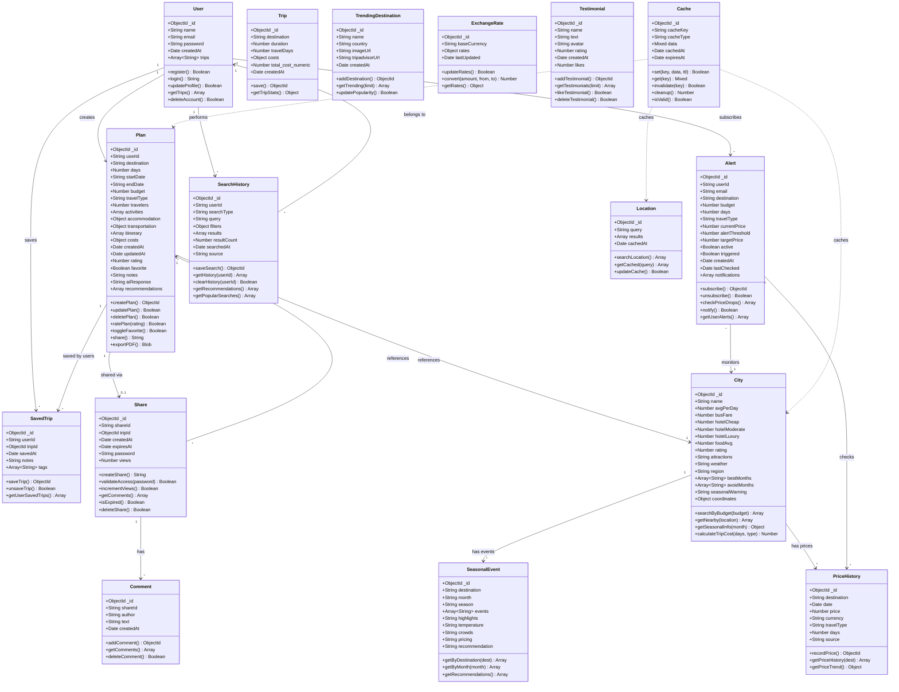
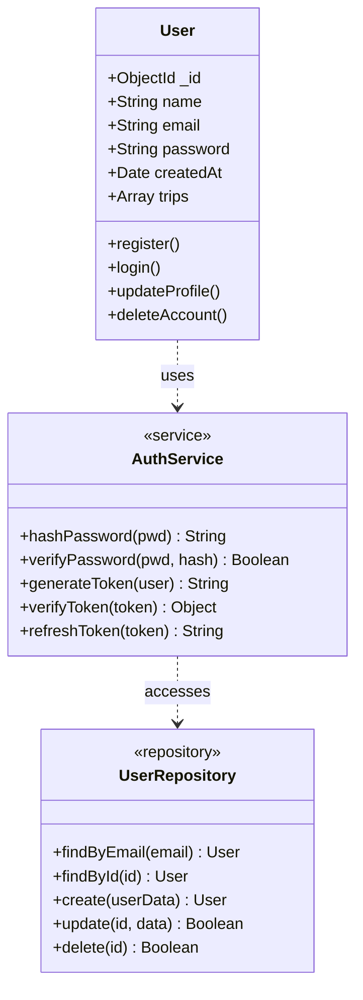
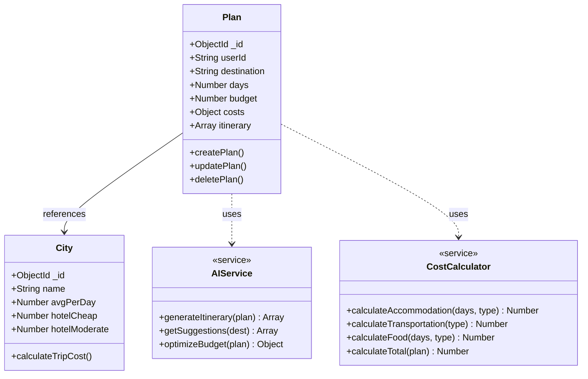
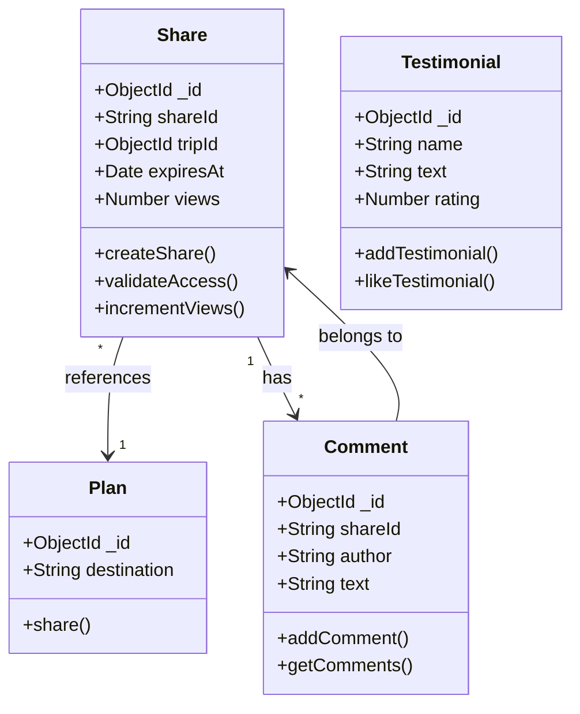
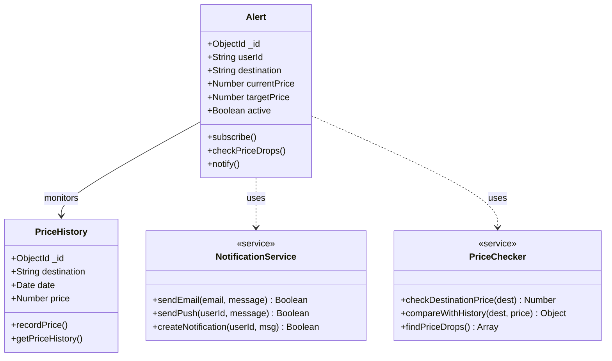
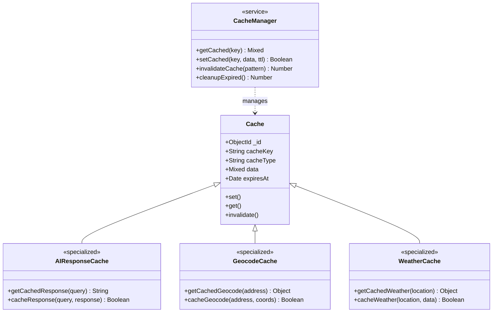
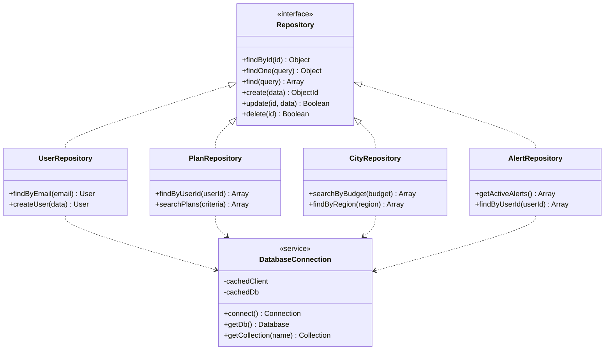
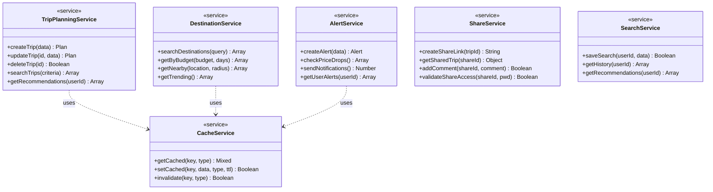
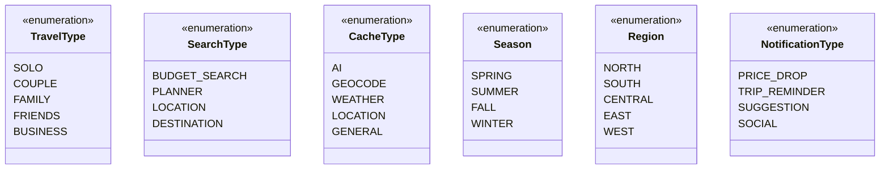
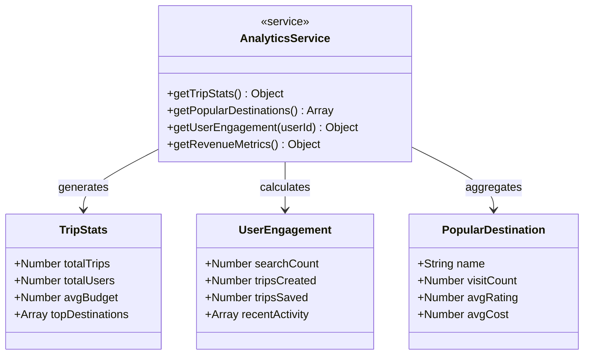

# Wanderly Trip Planner - Class Diagram

This document contains UML class diagrams for the Wanderly Trip Planner database schema.

## Main Class Diagram

## Detailed Component Diagrams

### User Management Component

### Trip Planning Component

### Sharing & Social Component

### Alert & Notification Component

### Cache & Performance Component

## Data Access Layer

## Service Layer Architecture

## Enum Definitions

## Aggregation Patterns

---

## Key Design Patterns Used

### 1. Repository Pattern
- Abstracts data access logic
- Provides clean interface for CRUD operations
- Used in: `UserRepository`, `PlanRepository`, `CityRepository`

### 2. Service Layer Pattern
- Encapsulates business logic
- Coordinates between repositories
- Used in: `TripPlanningService`, `AlertService`, `ShareService`

### 3. Cache-Aside Pattern
- Data loaded on-demand and cached
- Reduces database load
- Used in: `Cache`, `CacheManager`

### 4. Factory Pattern
- Creates different types of cache instances
- Used in: `CacheManager` for specialized caches

### 5. Observer Pattern
- Price alerts notify users of changes
- Used in: `Alert` system with `NotificationService`

---

## Legend

- **Solid line with arrow (-->)**: Association/Has-a relationship
- **Dashed line with arrow (..>)**: Dependency/Uses relationship  
- **Solid line with triangle (<|--)**: Inheritance/Is-a relationship
- **Cardinality**: "1" = one, "*" = many, "0..1" = zero or one

---

*Generated: January 17, 2026*
